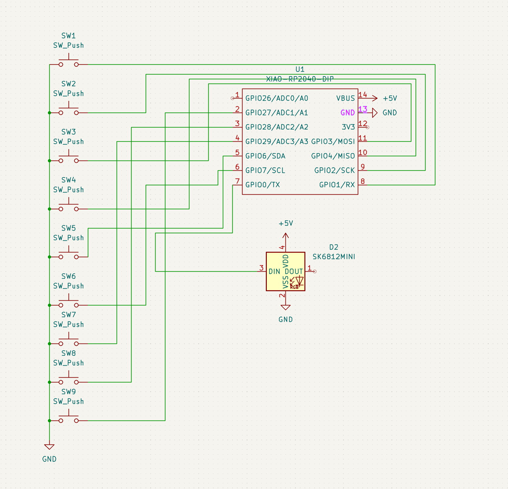
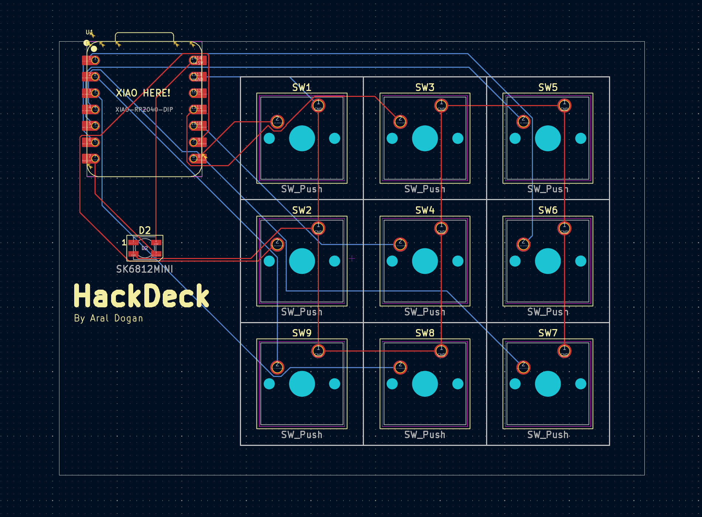
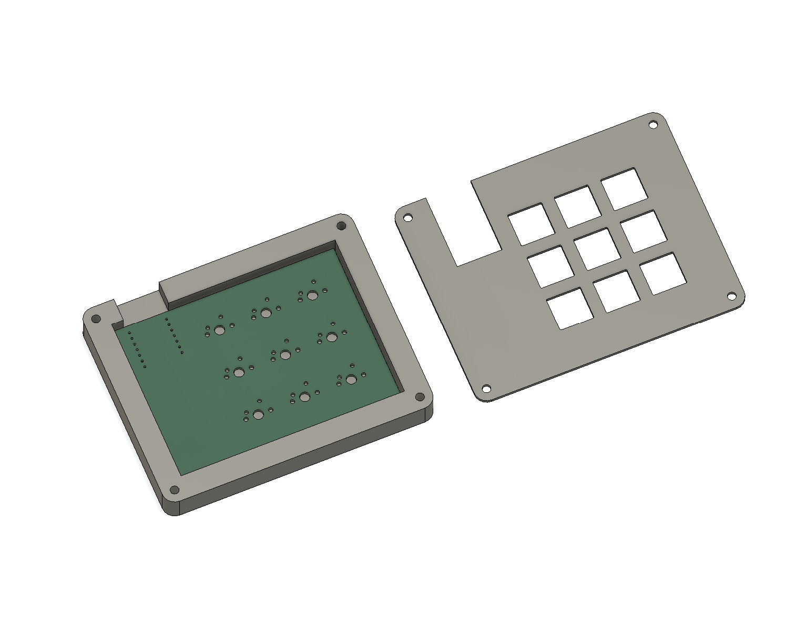

# HackDeck
HackDeck is a simple Python-based utility designed to streamline the process of opening files, applications, URLs, and more from a single command interface. Whether you're a developer, power user, or just want to speed up your workflow, HackDeck makes it quick and intuitive to access the things you need. (My first PCB project so it's probably not even near good but I'm still trying.)

## Features
Open files, folders, or applications with simple commands.
Launch URLs in your default browser.
Customizable: add your own shortcuts and commands.
Cross-platform support (Windows, macOS, Linux).
Lightweight and easy to use.

## Bill of Materials
1. 9x Cherry MX Switches
2. 1x XIAO RP2040
3. 1x Case (2 3D printed parts)
4. 1x SK6812 MINI Leds
5. 9x Blank DSA Keycaps
6. 4x M3x16 Bolt
7. 4x M3 Heatset
      

## PCB

## Case

